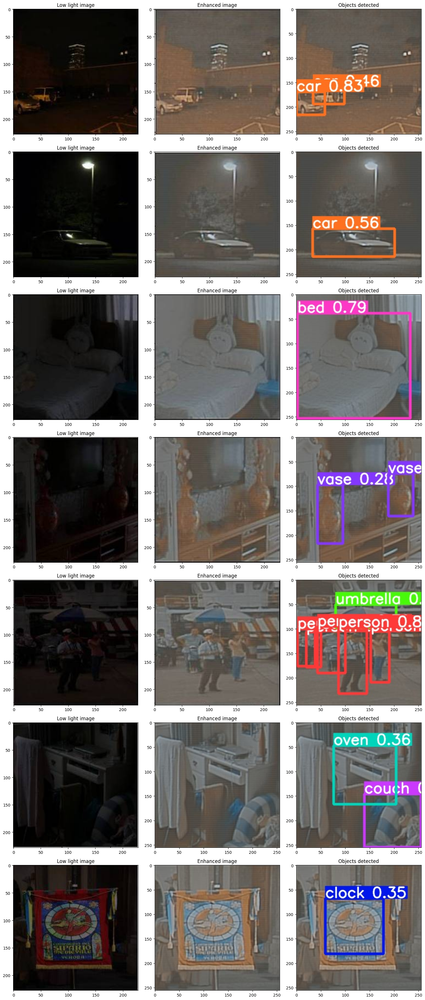

# Low Light Image Enhancement

## Introduction
Processing images in low-light conditions is a challenging problem in computer vision, affecting applications such as surveillance, autonomous driving, and medical imaging. This project employs deep learning-based methods to enhance low-light images and improve object detection accuracy using pre-trained models.

## Methodology
### Image Enhancement
Low-light images are enhanced using deep learning architectures such as CNNs, autoencoders, and U-Net. These networks learn mappings between low-light and well-lit images to restore object visibility while preserving structural details.

### Loss Functions
Evaluation is conducted using both traditional loss functions such as Mean Squared Error (MSE) and Peak Signal-to-Noise Ratio (PSNR), as well as perceptual losses like Structural Similarity Index Measure (SSIM), which assesses visual fidelity.

### Object Detection
After image enhancement, the YOLOv5 model is applied for object detection. YOLOv5 processes enhanced images to locate and classify objects efficiently.

## Dataset
- The **LOL dataset** (Low-Light dataset) with 500 paired normal and low-light images is used for supervised training.
- Additional datasets containing real-world low-light images are utilized to test model generalization.
## Dataset Preparation
Create a dataset folder with the following structure:
```
Folder/
    train/
        high/*.jpg
        low/*.jpg
    test/
        high/*.jpg
        low/*.jpg
```

## Object Detection with YOLOv5
1. Install YOLOv5:
   ```sh
   git clone https://github.com/ultralytics/yolov5.git
   cd yolov5
   pip install -r requirements.txt
   wget https://github.com/ultralytics/yolov5/releases/download/v5.0/yolov5s.pt
   ```
2. Run YOLO predictions:
   ```sh
   python detect.py --weights yolov5s.pt --img 256 --conf 0.25 --source ../Enhanced_images/
   ```
   Ensure correct paths to `detect.py` (inside `yolov5` folder) and `Enhanced_images/`.

## Results

- **Quantitative Comparisons**:
  - The **SSIM score** of our implementation: **0.816**, outperforming traditional methods.
  - PSNR results indicate that deep learning-based enhancement produces clearer images with reduced noise.
- **Visual Observations**:
  - The enhanced images preserve color fidelity and texture better than traditional methods.
  - Some minor issues such as noise amplification and slight blurring remain, requiring further optimization.

## Future Work
- Improve the YOLO model’s accuracy by fine-tuning it on enhanced images instead of pre-trained weights.
- Reduce noise amplification and color distortions for better image clarity.
- Explore more computationally efficient models for real-time processing.
   
## Acknowledgments
This project is an implementation of [kinD](https://arxiv.org/abs/1905.04161), a low-light image enhancement technique.
